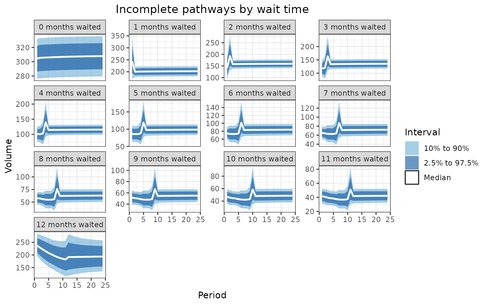

# Visualising projections

A proven effective way of presenting the outputs from waiting list
projections is using animated charts. These can be embedded in many
documents, including htmls and powerpoint files. This vignette shows how
to generate the charts from the functions provided in the NHSRtt
package.

The following libraries are needed for this vignette:

``` r
library(NHSRtt)
library(dplyr)
library(ggplot2)
library(gganimate)
library(forecast)
library(tidyr)
```

## Create the input data

The data used here is dummy data. The calibration period here is two
years, and the forecast period is also two years. Validation is not
performed here because the purpose of this vignette is simply to show
how to create animations.

``` r
max_months_waited <- 12
calibration_periods <- 24
seed <- 599
```

### Calibration

The calibration data are created and passed to the
[`calibrate_capacity_renege_params()`](https://nhs-bnssg-analytics.github.io/NHSRtt/reference/calibrate_capacity_renege_params.md)
function.

``` r
referrals <- create_dummy_data(
  type = "referral",
  max_months_waited = max_months_waited,
  number_periods = calibration_periods,
  referral_values = 500:600,
  seed = seed
)


incompletes <- create_dummy_data(
  type = "incomplete",
  max_months_waited = max_months_waited,
  number_periods = calibration_periods,
  max_incompletes = 500,
  seed = seed
)

completes <- create_dummy_data(
  type = "complete",
  max_months_waited = max_months_waited,
  number_periods = calibration_periods,
  max_treatments = 20,
  seed = seed
)

params <- calibrate_capacity_renege_params(
  referrals = referrals,
  incompletes = incompletes,
  completes = completes,
  max_months_waited = max_months_waited,
  redistribute_m0_reneges = TRUE,
  allow_negative_params = FALSE
)
```

### Projections - input data

When projecting, it is good to have a variety of projections
representing more and less severe scenarios. One way of projecting is
using a time series method, such as ARIMA or TBATS. Here we show how to
use TBATS, along with the uncertainty that is provided by the function.

For simplicity, the calibration data is re-used as projection data. The
inputs to the function are 24 months of referrals, 24 months of
treatments (completed pathways) and incomplete pathways for 1 time
period.

``` r
timesteps <- 24

# this function helps with repeated data manipulation; it contains the ts
# function (which turns the data into a time series - where the 12 indicates
# that is it a monthly time series), and also the tbats function, which performs
# the time series analysis on the time series
forecast_function <- function(rtt_table, number_timesteps) {
  fcast <- rtt_table |> 
    pull(value) |> 
    ts(frequency = 12) |> 
    forecast::tbats() |> 
    forecast::forecast(h = number_timesteps) |> 
    tidyr::as_tibble()
  
  return(fcast)
}

projection_referrals <- referrals |> 
  rename(
    value = referrals
  ) |> 
  forecast_function(
    number_timesteps = timesteps
  ) |> 
  mutate(
    type = "Referrals"
  )
```

This creates a table that looks like this (only the top 15 rows are
displayed). This table contains uncertainty in the projections.

| Point Forecast |    Lo 80 |    Hi 80 |    Lo 95 |    Hi 95 | type      |
|---------------:|---------:|---------:|---------:|---------:|:----------|
|       553.3873 | 525.5815 | 581.1932 | 510.8620 | 595.9127 | Referrals |
|       553.8094 | 525.8679 | 581.7509 | 511.0766 | 596.5422 | Referrals |
|       554.1981 | 526.1424 | 582.2539 | 511.2905 | 597.1058 | Referrals |
|       554.5562 | 526.4040 | 582.7083 | 511.5012 | 597.6112 | Referrals |
|       554.8859 | 526.6525 | 583.1193 | 511.7066 | 598.0652 | Referrals |
|       555.1896 | 526.8876 | 583.4916 | 511.9055 | 598.4738 | Referrals |
|       555.4693 | 527.1095 | 583.8292 | 512.0967 | 598.8420 | Referrals |
|       555.7270 | 527.3183 | 584.1356 | 512.2797 | 599.1743 | Referrals |
|       555.9642 | 527.5144 | 584.4141 | 512.4539 | 599.4745 | Referrals |
|       556.1828 | 527.6981 | 584.6674 | 512.6193 | 599.7462 | Referrals |
|       556.3840 | 527.8701 | 584.8980 | 512.7757 | 599.9924 | Referrals |
|       556.5694 | 528.0307 | 585.1081 | 512.9232 | 600.2156 | Referrals |
|       556.7401 | 528.1806 | 585.2997 | 513.0620 | 600.4182 | Referrals |
|       556.8974 | 528.3202 | 585.4746 | 513.1924 | 600.6024 | Referrals |
|       557.0422 | 528.4502 | 585.6342 | 513.3145 | 600.7699 | Referrals |

This is repeated for the number of treatments and the incomplete
pathways.

``` r
projection_complete <- completes |> 
  summarise(
    value = sum(treatments),
    .by = period_id
  ) |> 
  forecast_function(
    number_timesteps = timesteps
  ) |> 
  mutate(
    type = "Treatments"
  )

projection_incomplete <- incompletes |> 
  rename(
    value = incompletes
  ) |> 
  group_by(months_waited_id) |> 
  group_split() |> 
  lapply(
    forecast_function,
    number_timesteps = 1
  ) |> 
  setNames(nm = 0:12) |> 
  bind_rows(.id = "months_waited_id") |> 
  mutate(
    months_waited_id = as.numeric(months_waited_id)
  )
```

These inputs can be turned into scenarios. The more severe scenarios
would be those with higher incomplete pathways and higher referrals
combined with lower completed pathways. The less severe scenarios would
be the opposite.

``` r

# most severe (severe_1)

severe_1_referrals <- projection_referrals |> 
  pull(`Hi 95`)

severe_1_treatments <- projection_complete |> 
  pull(`Lo 95`)

severe_1_incomplete <- projection_incomplete |> 
  select(
    "months_waited_id",
    incompletes = "Hi 95"
  )

# 2nd most severe (severe_2)

severe_2_referrals <- projection_referrals |> 
  pull(`Hi 80`)

severe_2_treatments <- projection_complete |> 
  pull(`Lo 80`)

severe_2_incomplete <- projection_incomplete |> 
  select(
    "months_waited_id",
    incompletes = "Hi 80"
  )

# average

average_referrals <- projection_referrals |> 
  pull(`Point Forecast`)

average_treatments <- projection_complete |> 
  pull(`Point Forecast`)

average_incomplete <- projection_incomplete |> 
  select(
    "months_waited_id",
    incompletes = "Point Forecast"
  )


# 2nd mildest (mild_2)

mild_2_referrals <- projection_referrals |> 
  pull(`Lo 80`)

mild_2_treatments <- projection_complete |> 
  pull(`Hi 80`)

mild_2_incomplete <- projection_incomplete |> 
  select(
    "months_waited_id",
    incompletes = "Lo 80"
  )

# Mildest (mild_1)

mild_1_referrals <- projection_referrals |> 
  pull(`Lo 95`)

mild_1_treatments <- projection_complete |> 
  pull(`Hi 95`)

mild_1_incomplete <- projection_incomplete |> 
  select(
    "months_waited_id",
    incompletes = "Lo 95"
  )
```

### Projections - forecasts

The inputs are passed to the
[`apply_params_to_projections()`](https://nhs-bnssg-analytics.github.io/NHSRtt/reference/apply_params_to_projections.md)
function.

``` r
severe_1_projections <- apply_params_to_projections(
  capacity_projections = severe_1_treatments,
  referrals_projections = severe_1_referrals,
  incomplete_pathways = severe_1_incomplete,
  renege_capacity_params = params,
  max_months_waited = max_months_waited
) |> 
  mutate(
    scenario = "Most severe"
  )

severe_2_projections <- apply_params_to_projections(
  capacity_projections = severe_2_treatments,
  referrals_projections = severe_2_referrals,
  incomplete_pathways = severe_2_incomplete,
  renege_capacity_params = params,
  max_months_waited = max_months_waited
) |> 
  mutate(
    scenario = "2nd most severe"
  )

average_projections <- apply_params_to_projections(
  capacity_projections = average_treatments,
  referrals_projections = average_referrals,
  incomplete_pathways = average_incomplete,
  renege_capacity_params = params,
  max_months_waited = max_months_waited
) |> 
  mutate(
    scenario = "Average"
  )

mild_2_projections <- apply_params_to_projections(
  capacity_projections = mild_2_treatments,
  referrals_projections = mild_2_referrals,
  incomplete_pathways = mild_2_incomplete,
  renege_capacity_params = params,
  max_months_waited = max_months_waited
) |> 
  mutate(
    scenario = "2nd mildest"
  )

mild_1_projections <- apply_params_to_projections(
  capacity_projections = mild_1_treatments,
  referrals_projections = mild_1_referrals,
  incomplete_pathways = mild_1_incomplete,
  renege_capacity_params = params,
  max_months_waited = max_months_waited
) |> 
  mutate(
    scenario = "Mildest"
  )
```

## Visualisations

### Inputs

Stakeholders are often interested in the inputs to understand the
outputs better. These sections give some useful code for styling the
data used in bespoke analysis.

``` r
pal_bands <- c(
  'Middle' = '#6baed6',
  'Inner' = '#08519c',
  'Median' = '#FFFFFF'
)
  
  
bind_rows(
  projection_complete,
  projection_referrals
) |> 
  mutate(
    period_id = row_number(),
    .by = type
  ) |> 
  ggplot(
    aes(x = period_id)
  ) +
  geom_ribbon(
    aes(
      ymin = `Lo 80`, 
      ymax = `Hi 80`, 
      fill = 'Middle'
    ), 
    alpha = 0.6
  ) +
  geom_ribbon(
    aes(
      ymin = `Lo 95`, 
      ymax = `Hi 95`, 
      fill = 'Inner'
    ), 
    alpha = 0.6
  ) +
  geom_ribbon(
    aes(
      ymin = `Point Forecast`, 
      ymax = `Point Forecast`, 
      fill = 'Median'
    ), 
    color = 'black', 
  alpha = 0.6
  ) +
  geom_line(
    aes(
      y = `Point Forecast`,
      group = type
    ), 
    color = 'white', 
    linewidth = 1
  ) +
  theme_bw() +
  theme(plot.title = element_text(hjust = 0.5)) +
  facet_wrap(
    facets = vars(type),
    scales = "free_y"
  ) +
  labs(
    title = "Input range of completes pathways and referrals by period", 
    x = "Period", 
    y = "Volume"
  ) +
  scale_fill_manual(
    name = "Interval", 
    breaks = c('Middle', 'Inner', 'Median'),
    values = pal_bands, 
    labels = c(
      'Middle' = '10% to 90%', 
      'Inner' = '2.5% to 97.5%', 
      'Median' = 'Median'
    )
  )
```


## Static projections

A similar set of charts can be made for the waiting list projections.

``` r
bind_rows(
  mild_1_projections,
  mild_2_projections,
  average_projections,
  severe_2_projections,
  severe_1_projections
) |> 
  select(
    "period_id", "months_waited_id", "incompletes", "scenario"
  ) |> 
  pivot_wider(
    names_from = scenario,
    values_from = incompletes
  ) |> 
  rename(
    "Lo 80" = "Mildest",
    "Lo 95" = "2nd mildest",
    "Median" = "Average",
    "Hi 95" = "2nd most severe",
    "Hi 80" = "Most severe"
  ) |> 
  mutate(
    months_waited_id = paste(
      months_waited_id,
      "months waited"
    ),
    months_waited_id = factor(
      months_waited_id,
      levels = paste(0:12, "months waited")
    )
  ) |> 
  ggplot(
    aes(x = period_id)
  ) +
  geom_ribbon(
    aes(
      ymin = `Lo 80`, 
      ymax = `Hi 80`, 
      fill = 'Middle'
    ), 
    alpha = 0.6
  ) +
  geom_ribbon(
    aes(
      ymin = `Lo 95`, 
      ymax = `Hi 95`, 
      fill = 'Inner'
    ), 
    alpha = 0.6
  ) +
  geom_ribbon(
    aes(
      ymin = `Median`, 
      ymax = `Median`, 
      fill = 'Median'
    ), 
    color = 'black', 
  alpha = 0.6
  ) +
  geom_line(
    aes(
      y = `Median`,
      group = months_waited_id
    ), 
    color = 'white', 
    linewidth = 1
  ) +
  theme_bw() +
  theme(plot.title = element_text(hjust = 0.5)) +
  facet_wrap(
    facets = vars(months_waited_id),
    scales = "free_y"
  ) +
  labs(
    title = "Incomplete pathways by wait time", 
    x = "Period", 
    y = "Volume"
  ) +
  scale_fill_manual(
    name = "Interval", 
    breaks = c('Middle', 'Inner', 'Median'),
    values = pal_bands, 
    labels = c(
      'Middle' = '10% to 90%', 
      'Inner' = '2.5% to 97.5%', 
      'Median' = 'Median'
    )
  )
```



## Animated projections

This can also be displayed as a rolling animation.

``` r
bind_rows(
  mild_1_projections,
  mild_2_projections,
  average_projections,
  severe_2_projections,
  severe_1_projections
) |> 
  select(
    "period_id", "months_waited_id", "incompletes", "scenario"
  ) |> 
  mutate(
    scenario = factor(
      scenario,
      levels = c(
        "Mildest",
        "2nd mildest",
        "Average",
        "2nd most severe",
        "Most severe"
      )
    ),
    period_id = as.integer(period_id)
  ) |> 
  ggplot(
    aes(
      x = months_waited_id,
      y = incompletes
    )
  ) +
  geom_col(
    aes(
      group = period_id
    ),
    fill = "#08519c"
  ) +
  theme_bw() +
  theme(plot.title = element_text(hjust = 0.5)) +
  labs(
    title = "Incomplete pathways by number of months waited: period {frame_time}",
    x = "Number of months waited",
    y = "Number of incompete pathways"
  ) +
  facet_wrap(
    facets = vars(scenario)
  ) +
  transition_time(
    period_id
  )
```


