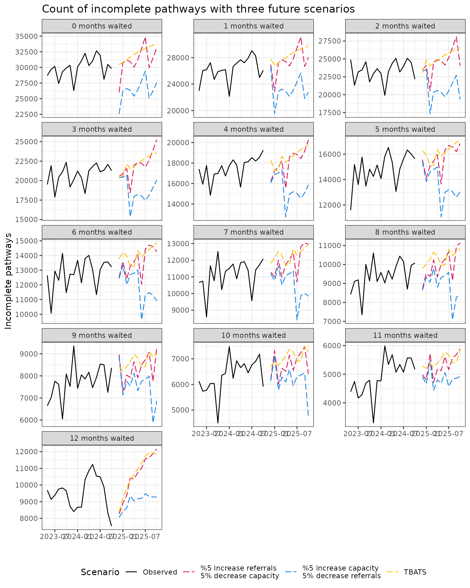

# Creating and validating a model

``` r
library(NHSRtt)
library(dplyr)
library(tidyr)
library(lubridate)
library(ggplot2)
library(forecast)
```

This vignette provides a walkthrough for how to use the NHSRtt package.

The vignette shows:

1.  how the data are set up
2.  how the renege and capacity parameters are calculated
3.  how the parameter performance can be validated
4.  how the parameters can be applied to future scenarios

## Aims

The aim of the exercise in this vignette is, for a selected acute trust,
to predict future activity, and hence waiting times, for all elective
activity at that trust.

This is done by developing some model parameters, based on a
stock-and-flow approach over a time period (called the calibration
period). These parameters are calculated from publicly available data,
which are counts of incomplete pathways, completed pathways and new
referrals at each time step. The completed and incomplete pathways are
broken down into the number of months the individuals in the pathways
have been waiting.

These parameters are then applied to a subsequent time period (called
the validation period). The parameters are used to generate estimated
incomplete activity for this period. This activity is compared with the
observed activity to evaluate the modelling.

The final part is to apply the model parameters to some future scenarios
to predict future waiting times.

## Setting up the data

Conceptually, we want to use a year of data to calibrate parameters, and
then the following six months to validate those parameters. We will then
use these parameters to predict for the year following the valdiation
period.

``` r

calibration_start <- as.Date("2023-05-01")
calibration_end <- as.Date("2024-04-30")
validation_start <- calibration_end + 1
validation_end <- as.Date("2024-10-31")
prediction_start <- validation_end + 1
prediction_end <- as.Date("2025-10-31")
analysis_trust <- "RC9" # filter for a single trust
max_months_waited <- 12 # I am only interested in waiting time bins up to 12 months
```


The public data
([source](https://www.england.nhs.uk/statistics/statistical-work-areas/rtt-waiting-times/))
can be sourced with the
[`get_rtt_data()`](https://nhs-bnssg-analytics.github.io/NHSRtt/reference/get_rtt_data.md)
function. The data we are interested from the website are the pathways
that are admitted and non-admitted (these are considered completed
pathways), incomplete (these are people who are still waiting to be
admitted), and new RTT periods (these are new referrals that are
entering the referral to treatment pathway). The data are provided by
trust_parent_org_code, commissioner_parent_org_code,
commissioner_org_code, trust and specialty, so can be aggregated
depending on the analysis of interest.

``` r

monthly_rtt <- NHSRtt::get_rtt_data(
  date_start = calibration_start,
  date_end = validation_end,
  trust_codes = analysis_trust, # the trust we are interested in
  show_progress = FALSE # can change this to TRUE to see progress
)
```

Here is what the first 15 rows of data for the monthly_rtt object looks
like when it comes out of the
[`get_rtt_data()`](https://nhs-bnssg-analytics.github.io/NHSRtt/reference/get_rtt_data.md)
function (this may change if this is run on a different date as the data
update monthly on the live website):

| trust_parent_org_code | commissioner_parent_org_code | commissioner_org_code | trust | specialty | period     | months_waited | type       |     value |
|:----------------------|:-----------------------------|:----------------------|:------|:----------|:-----------|:--------------|:-----------|----------:|
| QHG                   | NA                           | 13Q                   | RC9   | C_100     | 2024-10-01 | \<1           | Incomplete | 0.0000000 |
| QHG                   | NA                           | 13Q                   | RC9   | C_100     | 2024-10-01 | 1-2           | Incomplete | 2.0000000 |
| QHG                   | NA                           | 13Q                   | RC9   | C_100     | 2024-10-01 | 2-3           | Incomplete | 0.0000000 |
| QHG                   | NA                           | 13Q                   | RC9   | C_100     | 2024-10-01 | 3-4           | Incomplete | 0.0000000 |
| QHG                   | NA                           | 13Q                   | RC9   | C_100     | 2024-10-01 | 4-5           | Incomplete | 1.0000000 |
| QHG                   | NA                           | 13Q                   | RC9   | C_100     | 2024-10-01 | 5-6           | Incomplete | 0.0000000 |
| QHG                   | NA                           | 13Q                   | RC9   | C_100     | 2024-10-01 | 6-7           | Incomplete | 0.5714286 |
| QHG                   | NA                           | 13Q                   | RC9   | C_100     | 2024-10-01 | 7-8           | Incomplete | 0.4285714 |
| QHG                   | NA                           | 13Q                   | RC9   | C_100     | 2024-10-01 | 8-9           | Incomplete | 0.0000000 |
| QHG                   | NA                           | 13Q                   | RC9   | C_100     | 2024-10-01 | 9-10          | Incomplete | 0.0000000 |
| QHG                   | NA                           | 13Q                   | RC9   | C_100     | 2024-10-01 | 10-11         | Incomplete | 0.0000000 |
| QHG                   | NA                           | 13Q                   | RC9   | C_100     | 2024-10-01 | 11-12         | Incomplete | 0.0000000 |
| QHG                   | NA                           | 13Q                   | RC9   | C_100     | 2024-10-01 | 12-13         | Incomplete | 0.0000000 |
| QHG                   | NA                           | 13Q                   | RC9   | C_100     | 2024-10-01 | 13-14         | Incomplete | 0.0000000 |
| QHG                   | NA                           | 13Q                   | RC9   | C_100     | 2024-10-01 | 14-15         | Incomplete | 0.0000000 |

Example data set following the download from the NHS website.

For the purposes of this vignette, where we are performing the analysis
on all activity (rather than by specialty), we aggregate the data
(because the selected trust will have multiple records assigned to the
different commissioners, commissioner parent and trust parent) before
splitting it out again later into three datasets. The data manipulation
here takes five steps:

1.  change the “type” column into “Complete”, “Incomplete” and
    “Referrals”
2.  convert the months_waited string into an id using the
    [`convert_months_waited_to_id()`](https://nhs-bnssg-analytics.github.io/NHSRtt/reference/convert_months_waited_to_id.md)
    function
3.  aggregate all the counts by specialty into one overall figure
4.  create a “period_id” numeric field for the sequential months in the
    dataset

``` r
monthly_rtt <- monthly_rtt |> 
  mutate(
    months_waited_id = convert_months_waited_to_id(
      months_waited,
      max_months_waited
    )
  ) |>
  summarise(
    value = sum(value),
    .by = c(
      trust,
      period,
      type,
      months_waited_id
    )
  ) |> 
  arrange(
    type,
    months_waited_id,
    period
  ) |> 
  mutate(
    period_id = dplyr::row_number(), # we need period_id for later steps
    .by = c(
      type,
      months_waited_id
    )
  )
```

| trust | period     | type     | months_waited_id |    value | period_id |
|:------|:-----------|:---------|-----------------:|---------:|----------:|
| RC9   | 2023-05-01 | Complete |                0 | 8507.429 |         1 |
| RC9   | 2023-06-01 | Complete |                0 | 8585.143 |         2 |
| RC9   | 2023-07-01 | Complete |                0 | 8612.571 |         3 |
| RC9   | 2023-08-01 | Complete |                0 | 8996.857 |         4 |
| RC9   | 2023-09-01 | Complete |                0 | 8326.857 |         5 |
| RC9   | 2023-10-01 | Complete |                0 | 9026.286 |         6 |

Example few records from the monthly_rtt object.

The data need to be in a specific format (as described by the function
documentation) for the functions to work.

To calculate the renege and capacity parameters, the inputs you needs
are:

1.  Referrals per time step (these are inputs to each time step), where
    all referrals have waited 0 months
2.  Complete pathways per time step by the number of months waited
3.  Incomplete pathways per time step by the number of months waited

Here, we split the data out again into three objects (completes,
incompletes and referrals)

``` r

calibration_period <- monthly_rtt |>
  filter(
    between(
      period,
      calibration_start,
      calibration_end
    )
  ) |>
  summarise(
    value = sum(value),
    .by = c(
      trust,
      period_id,
      type,
      months_waited_id
    )
  ) |>
  dplyr::select(
    trust,
    period_id,
    type,
    months_waited_id,
    value
  )

referrals <- calibration_period |>
  filter(
    type == "Referrals"
  ) |>
  distinct(
    period_id,
    value
  ) |>
  rename(
    referrals = "value"
  )
```

| period_id | referrals |
|----------:|----------:|
|         1 |     35380 |
|         2 |     36790 |
|         3 |     35216 |
|         4 |     35380 |
|         5 |     35974 |
|         6 |     36914 |
|         7 |     39022 |
|         8 |     31528 |
|         9 |     38668 |
|        10 |     38112 |
|        11 |     37422 |
|        12 |     36730 |

Example referrals data set.

``` r
completes <- calibration_period |>
  filter(
    type == "Complete"
  ) |>
  distinct(
    period_id,
    months_waited_id,
    value
  ) |>
  rename(
    treatments = "value"
  )
```

| period_id | months_waited_id | treatments |
|----------:|-----------------:|-----------:|
|         1 |                0 |   8507.429 |
|         2 |                0 |   8585.143 |
|         3 |                0 |   8612.571 |
|         4 |                0 |   8996.857 |
|         5 |                0 |   8326.857 |
|         6 |                0 |   9026.286 |
|         7 |                0 |   9678.857 |
|         8 |                0 |   8187.429 |
|         9 |                0 |   9364.286 |
|        10 |                0 |   8521.714 |
|        11 |                0 |   8662.571 |
|        12 |                0 |   8489.714 |

Example completes data set.

``` r
incompletes <- calibration_period |>
  filter(
    type == "Incomplete"
  ) |>
  distinct(
    period_id,
    months_waited_id,
    value
  ) |>
  rename(
    incompletes = "value"
  )
```

| period_id | months_waited_id | incompletes |
|----------:|-----------------:|------------:|
|         1 |                0 |    28717.71 |
|         2 |                0 |    29707.71 |
|         3 |                0 |    30145.71 |
|         4 |                0 |    27426.86 |
|         5 |                0 |    29318.00 |
|         6 |                0 |    29889.71 |
|         7 |                0 |    30338.00 |
|         8 |                0 |    26303.14 |
|         9 |                0 |    30080.86 |
|        10 |                0 |    31047.71 |
|        11 |                0 |    32260.29 |
|        12 |                0 |    30302.00 |

Example completes data set.

## Generating the model parameters

These inputs are passed into the
[`calibrate_capacity_renege_params()`](https://nhs-bnssg-analytics.github.io/NHSRtt/reference/calibrate_capacity_renege_params.md)
function.

For occasions where renege counts are negative for the group of people
that have been waiting 0 months, we can tell the modelling to assume
these are under-reported referrals and redistribute these to referrals.
This is done by setting the `redistribute_m0_reneges` to TRUE.

``` r
params <- calibrate_capacity_renege_params(
  referrals = referrals,
  completes = completes,
  incompletes = incompletes,
  max_months_waited = max_months_waited,
  # if negative reneges are calculated in the first waiting bin, these are
  # reassigned as referrals when redistribute_m0_reneges value is TRUE (though
  # we must make sure that referrals passed to the projection period are
  # uplifted in the same way for consistency)
  redistribute_m0_reneges = FALSE, 
  # full_breakdown can be set to TRUE to see all the transitions for all months
  # waited at each time step
  full_breakdown = FALSE,
  allow_negative_params = FALSE
)
```

| months_waited_id | renege_param | capacity_param |
|-----------------:|-------------:|---------------:|
|                0 |    0.0000000 |      0.2403923 |
|                1 |    0.0389801 |      0.0817526 |
|                2 |    0.0447245 |      0.0611592 |
|                3 |    0.0490417 |      0.0608100 |
|                4 |    0.1029427 |      0.0580420 |
|                5 |    0.0745862 |      0.0541527 |
|                6 |    0.0713906 |      0.0550176 |
|                7 |    0.0644309 |      0.0562033 |
|                8 |    0.0921807 |      0.0617992 |
|                9 |    0.0941592 |      0.0678298 |
|               10 |    0.1112169 |      0.0716694 |
|               11 |    0.1397000 |      0.0857675 |
|               12 |    0.1913410 |      0.1346886 |

The structure of the output from the
[`calibrate_capacity_renege_params()`](https://nhs-bnssg-analytics.github.io/NHSRtt/reference/calibrate_capacity_renege_params.md)
function.

The renege parameter is a ratio of the mean number of patients that
renege from the stock compared with the mean number entering the stock
by months waited in the calibration period. The capacity parameter is
the same as the renege parameter, but comparing the mean pathways
completed with the mean count of individuals entering the stock.

## Validate these parameters on a known time series

Pass the parameters to a known timeseries, and calculate an evaluation
metric, comparing the predicted count of incomplete pathways with the
known count of incomplete pathways.

The example below calculates the mean absolute percentage error (MAPE).

First, the data needs constructing. The data required are:

1.  a vector of capacity per time step
2.  a vector of referrals per time step
3.  a table of counts of incomplete pathways by months waiting for the
    time step prior to the first time step of the other two data inputs

To create these data we take the full dataset we created earlier and
filter for the validation time period.

``` r

validation_period <- monthly_rtt |>
  filter(
    between(
      period,
      validation_start %m-% months(1), # this helps the user pick up the incompletes from the previous month
      validation_end
    )
  ) |>
  dplyr::select(
    trust,
    period_id,
    type,
    months_waited_id,
    value
  )

validation_referrals <- validation_period |>
  filter(
    type == "Referrals",
    period_id != min(period_id)
  ) |>
  distinct(
    period_id,
    value
  ) |>
  arrange(
    period_id
  ) |> 
  pull(
    value
  )

print(validation_referrals)
#> [1] 37566 39590 41640 35752 37910 39896

validation_capacity <- validation_period |>
  filter(
    type == "Complete",
    period_id != min(period_id)
  ) |> 
  summarise(
    count = sum(value),
    .by = period_id
  ) |>
  arrange(
    period_id
  ) |> 
  pull(
    count
  )

print(validation_capacity)
#> [1] 21484 21824 22232 21306 22520 23008

incompletes_at_t0 <- validation_period |>
  filter(
    type == "Incomplete",
    period_id == min(period_id)
  ) |>
  distinct(
    months_waited_id,
    value
  ) |>
  rename(
    incompletes = "value"
  )
```

| months_waited_id | incompletes |
|-----------------:|------------:|
|                0 |   30302.000 |
|                1 |   27669.714 |
|                2 |   24388.000 |
|                3 |   21297.143 |
|                4 |   15651.429 |
|                5 |   15359.714 |
|                6 |   14005.429 |
|                7 |   11848.286 |
|                8 |    9223.714 |
|                9 |    8165.429 |
|               10 |    6658.857 |
|               11 |    5682.857 |
|               12 |   10859.429 |

Example of the structure of the incomplete pathways at t=0 that gets
passed into the
[`apply_params_to_projections()`](https://nhs-bnssg-analytics.github.io/NHSRtt/reference/apply_params_to_projections.md)
function.

The data are then passed to
[`apply_params_to_projections()`](https://nhs-bnssg-analytics.github.io/NHSRtt/reference/apply_params_to_projections.md)
which provides a full table of stocks at each time step.

``` r
validation_performance <- apply_params_to_projections(
  capacity_projections = validation_capacity,
  referrals_projections = validation_referrals,
  incomplete_pathways = incompletes_at_t0,
  renege_capacity_params = params,
  max_months_waited = max_months_waited
)
```

| period_id | months_waited_id | calculated_treatments |   reneges | incompletes |
|----------:|-----------------:|----------------------:|----------:|------------:|
|         1 |                0 |             8383.8462 |    0.0000 |   29182.154 |
|         1 |                1 |             2299.8566 | 1181.1739 |   26820.969 |
|         1 |                2 |             1571.0662 | 1237.5128 |   24861.135 |
|         1 |                3 |             1376.8263 | 1196.0281 |   21815.146 |
|         1 |                4 |             1147.6027 | 2192.3861 |   17957.154 |
|         1 |                5 |              786.8677 | 1167.3807 |   13697.180 |
|         1 |                6 |              784.5353 | 1096.5386 |   13478.640 |
|         1 |                7 |              730.7786 |  902.3821 |   12372.268 |
|         1 |                8 |              679.7760 | 1092.1829 |   10076.327 |
|         1 |                9 |              580.8369 |  868.4978 |    7774.380 |
|         1 |               10 |              543.3010 |  908.1333 |    6713.994 |
|         1 |               11 |              530.2128 |  930.2423 |    5198.402 |
|         1 |               12 |             2068.4937 | 3165.2174 |   11308.575 |
|         2 |                0 |             8797.5131 |    0.0000 |   30792.487 |
|         2 |                1 |             2205.3264 | 1137.5222 |   25839.305 |
|         2 |                2 |             1516.3182 | 1199.5531 |   24105.098 |
|         2 |                3 |             1397.4941 | 1219.2314 |   22244.410 |
|         2 |                4 |             1170.4541 | 2245.7107 |   18398.981 |
|         2 |                5 |              898.8999 | 1339.3560 |   15718.898 |
|         2 |                6 |              696.6050 |  977.8493 |   12022.726 |

Example of the outputs from the
[`apply_params_to_projections()`](https://nhs-bnssg-analytics.github.io/NHSRtt/reference/apply_params_to_projections.md)
function.

The mean absolute percentage error (mape) can then be calculated from
this.

``` r
# calculate mean absolute percentage error
# 1. calculate observed incompletes by months waited and period
observed_incompletes <- validation_period |> 
  filter(
    type == "Incomplete",
    period_id != min(period_id)
  ) |> 
  summarise(
    observed = sum(value),
    .by = c(
      period_id, months_waited_id
    )
  )  |> 
  mutate(
    period_id = period_id - min(period_id) + 1 # to change the period_ids to the same scale as the ones calculated
  )

# 2. quantify observed incompletes by months waited and period
estimated_incompletes <- validation_performance |> 
  dplyr::select(
    "period_id", 
    "months_waited_id",
    predicted = "incompletes"
  )

# 3. calculate mape
mape <- observed_incompletes |> 
  left_join(
    estimated_incompletes,
    by = join_by(
      period_id, months_waited_id
    )
  ) |> 
  mutate(
    absolute_percentage_error = abs(
      (predicted - observed) / observed
    )
  ) |> 
  summarise(
    mean_absolute_percentage_error = mean(
      absolute_percentage_error
    )
  ) |> 
  pull(mean_absolute_percentage_error)

print(mape)
#> [1] 0.04658936
```

The mean absolute error (mae) can also be calculated:

``` r
mae <- observed_incompletes |> 
  left_join(
    estimated_incompletes,
    by = join_by(
      period_id, months_waited_id
    )
  ) |> 
  mutate(
    absolute_error = abs(
      predicted - observed
    )
  ) |> 
  summarise(
    mean_absolute_error = mean(
      absolute_error
    )
  ) |> 
  pull(mean_absolute_error)

print(mae)
#> [1] 613.1636
```

The mean absolute percentage error for the modelled parameters is 4.7%
and the mean absolute error is 613.2.

## Future scenarios

This section describes how to apply the parameters to different future
scenarios. The process is identical to the validation process, but
without the evaluation step (as we are predicting for a time period with
unknown data).

The three scenarios are:

1.  referrals increasing by 5% and capacity reducing by 5% compared with
    the equivalent months in the previous year
2.  referrals decreasing by 5% and capacity increasing by 5% compared
    with the equivalent months in the previous year
3.  using a timeseries method (TBATS) to forecast referrals and capacity

``` r

## Scenario 1 data 

# move the date forward a year and uplift referrals and lower the completed
# pathways; then filter for the dates of interest
scenario_1 <- monthly_rtt |> 
  mutate(
    period = period %m+% months(12),
    value = case_when(
      type == "Referrals" ~ value * 1.05,
      type == "Complete" ~ value * 0.95,
      .default = value
    )
  ) |> 
  filter(
    between(
      period,
      prediction_start,
      prediction_end
    )
  )

# scenario 1 referrals

scenario_1_referrals <- scenario_1 |>
  filter(
    type == "Referrals",
    period_id != min(period_id)
  ) |>
  arrange(
    period_id
  ) |> 
  pull(
    value
  )

scenario_1_capacity <- scenario_1 |>
  filter(
    type == "Complete",
    period_id != min(period_id)
  ) |> 
  summarise(
    count = sum(value),
    .by = period_id
  ) |>
  arrange(
    period_id
  ) |> 
  pull(
    count
  )

scenario_1_incompletes_at_t0 <- scenario_1 |>
  filter(
    type == "Incomplete",
    period_id == min(period_id)
  ) |>
  distinct(
    months_waited_id,
    value
  ) |>
  rename(
    incompletes = "value"
  )


## Scenario 2

# move the date forward a year, uplift completed pathways and lower the
# referrals; then filter for the dates of interest

scenario_2 <- monthly_rtt |> 
  mutate(
    period = period %m+% months(12),
    value = case_when(
      type == "Complete" ~ value * 1.05,
      type == "Referrals" ~ value * 0.95,
      .default = value
    )
  ) |> 
  filter(
    between(
      period,
      prediction_start,
      prediction_end
    )
  )

scenario_2_referrals <- scenario_2 |>
  filter(
    type == "Referrals",
    period_id != min(period_id)
  ) |>
  arrange(
    period_id
  ) |> 
  pull(
    value
  )

scenario_2_capacity <- scenario_2 |>
  filter(
    type == "Complete",
    period_id != min(period_id)
  ) |> 
  summarise(
    count = sum(value),
    .by = period_id
  ) |>
  arrange(
    period_id
  ) |> 
  pull(
    count
  )

scenario_2_incompletes_at_t0 <- scenario_2 |>
  filter(
    type == "Incomplete",
    period_id == min(period_id)
  ) |>
  distinct(
    months_waited_id,
    value
  ) |>
  rename(
    incompletes = "value"
  )
```

For the timeseries data, using tbats, we want a slightly longer dataset
than we have available, so first we download an extra six months of data
to append onto the start of the existing dataset, before doing the data
manipulation prior to the forecasting. This will give us two years in
total.


``` r
# obtain and manipulate tbats data
additional_start <- calibration_start %m-% months(6)
additional_end <- calibration_start - 1


# each metric must be downloaded separately
additional_monthly_rtt <- NHSRtt::get_rtt_data(
  date_start = additional_start,
  date_end = additional_end,
  trust_codes = analysis_trust
) |> 
  mutate(
    months_waited_id = convert_months_waited_to_id(
      months_waited,
      max_months_waited
    )
  ) |>
  summarise(
    value = sum(value),
    .by = c(
      trust,
      period,
      type,
      months_waited_id
    )
  ) |> 
  arrange(
    type,
    months_waited_id,
    period
  ) |> 
  mutate(
    # here we relate the period_id to the period_id in the monthly_rtt data
    # which we will apend this additional data to
    period_id = (lubridate::interval(
      min(monthly_rtt$period), period
    ) %/% months(1)) + 1
  )

tbats_monthly_rtt <- bind_rows(
  additional_monthly_rtt,
  monthly_rtt
) |> 
  arrange(
    type, months_waited_id, period
  )

## Scenario 3

forecast_function <- function(rtt_table, number_timesteps) {
  fcast <- rtt_table |> 
    pull(value) |> 
    ts(frequency = 12) |> 
    forecast::tbats() |> 
    forecast::forecast(h = number_timesteps) |> 
    tidyr::as_tibble() |> 
    pull(`Point Forecast`)
  
  return(fcast)
}

scenario_3_referrals <- tbats_monthly_rtt |> 
  filter(
    type == "Referrals"
  ) |> 
  forecast_function(
    number_timesteps = 12
  ) |> 
  tail(11)

scenario_3_capacity <-  tbats_monthly_rtt |> 
  filter(
    type == "Complete"
  ) |> 
  summarise(
    value = sum(value),
    .by = period_id
  ) |> 
  forecast_function(
    number_timesteps = 12
  ) |> 
  tail(11)

scenario_3_incompletes_at_t0 <- tbats_monthly_rtt |> 
  filter(
    type == "Incomplete"
  ) |> 
  group_by(months_waited_id) |> 
  group_split() |> 
  lapply(
    forecast_function,
    number_timesteps = 1
  ) |> 
  unlist() |> 
  setNames(nm = 0:12) |> 
  # turn the named vector into a two column tibble
  (\(x) dplyr::tibble(
    months_waited_id = as.numeric(names(x)),
    incompletes = x
  ))()
  
```

For each scenario, the data are passed to the
[`apply_params_to_projections()`](https://nhs-bnssg-analytics.github.io/NHSRtt/reference/apply_params_to_projections.md)
function and then appended to each other.

``` r
 scenario_1_projections <- apply_params_to_projections(
  capacity_projections = scenario_1_capacity,
  referrals_projections = scenario_1_referrals,
  incomplete_pathways = scenario_1_incompletes_at_t0,
  renege_capacity_params = params,
  max_months_waited = max_months_waited
) |> 
  mutate(
    scenario = "Scenario 1"
  )

scenario_2_projections <- apply_params_to_projections(
  capacity_projections = scenario_2_capacity,
  referrals_projections = scenario_2_referrals,
  incomplete_pathways = scenario_2_incompletes_at_t0,
  renege_capacity_params = params,
  max_months_waited = max_months_waited
) |> 
  mutate(
    scenario = "Scenario 2"
  )

scenario_3_projections <- apply_params_to_projections(
  capacity_projections = scenario_3_capacity,
  referrals_projections = scenario_3_referrals,
  incomplete_pathways = scenario_3_incompletes_at_t0,
  renege_capacity_params = params,
  max_months_waited = max_months_waited
) |> 
  mutate(
    scenario = "Scenario 3"
  )

projections <- bind_rows(
  scenario_1_projections,
  scenario_2_projections,
  scenario_3_projections
) |> 
  select(
    "period_id",
    "months_waited_id",
    value = "incompletes",
    "scenario"
  ) |> 
  # here we adjust the period_id field to follow on from the latest period_id in
  # the validation dataset (because the apply_params_to_projections function
  # resets the earliest period_id to 1)
  mutate(
    # 1 is added to the end because the first period is used for the count of
    # incomplete pathways at t=0
    period_id = period_id + max(validation_period$period_id) + 1
  )
```

Here is a sample of the projection data:

| period_id | months_waited_id |     value | scenario   |
|----------:|-----------------:|----------:|:-----------|
|        20 |                0 | 26004.634 | Scenario 1 |
|        20 |                1 | 26942.703 | Scenario 1 |
|        20 |                2 | 23471.535 | Scenario 1 |
|        20 |                3 | 20562.509 | Scenario 1 |
|        20 |                4 | 16213.826 | Scenario 1 |
|        20 |                5 | 15562.287 | Scenario 1 |
|        20 |                6 | 12526.705 | Scenario 1 |
|        20 |                7 | 11270.479 | Scenario 1 |
|        20 |                8 |  8724.919 | Scenario 1 |
|        20 |                9 |  8966.015 | Scenario 1 |

A sample of the projections object.

We need to attach the date onto the data to help visualising it:

``` r

date_lkp <- dplyr::tibble(
  period = seq(
    # 1 is added to the end because the first period is used for the count of
    # incomplete pathways at t=0
    from = prediction_start %m+% months(1),
    to = prediction_end,
    by = "months"
  ),
  period_id = seq(
    from = min(projections$period_id),
    to = max(projections$period_id),
    by = 1
  )
)

projections <- projections |> 
  left_join(
    date_lkp,
    by = join_by(
      period_id
    )
  )
```

This data can now be appended to the observed incomplete pathways data
to visualise how incomplete pathways change by the number of months
waited over the projection period:

``` r

monthly_rtt |> 
  filter(
    type == "Incomplete"
  ) |> 
  select(
    "period", "period_id", "months_waited_id", "value"
  ) |> 
  mutate(
    scenario = "Observed"
  ) |> 
  bind_rows(
    projections
  ) |> 
  mutate(
    scenario = case_when(
      scenario == "Scenario 1" ~ "%5 increase referrals\n5% decrease capacity",
      scenario == "Scenario 2" ~ "%5 increase capacity\n5% decrease referrals",
      scenario == "Scenario 3" ~ "TBATS",
      .default = scenario
    ),
    scenario = factor(
      scenario,
      levels = c(
        "Observed",
        "%5 increase referrals\n5% decrease capacity",
        "%5 increase capacity\n5% decrease referrals",
        "TBATS"
      )
    ),
    months_waited_id = paste(
      months_waited_id,
      "months waited"
    ),
    months_waited_id = factor(
      months_waited_id,
      levels = paste(0:12, "months waited")
    )
  ) |> 
  ggplot(
    aes(
      x = period,
      y = value
    )
  ) +
  geom_line(
    aes(
      group = interaction(months_waited_id, scenario),
      linetype = scenario,
      colour = scenario
    )
  ) +
  facet_wrap(
    facets = vars(months_waited_id),
    scales = "free_y",
    ncol = 3
  ) +
  theme_bw() +
  theme(
    legend.position = "bottom"
  ) +
  labs(
    y = "Incomplete pathways",
    x = "",
    title = "Count of incomplete pathways with three future scenarios"
  ) +
  scale_colour_manual(
    name = "Scenario",
    values = c(
      "Observed" = "black",
      "%5 increase referrals\n5% decrease capacity" = "#D81B60",
      "%5 increase capacity\n5% decrease referrals" = "#1E88E5",
      "TBATS" = "#FFC107"
    )
  ) +
  scale_linetype_manual(
    name = "Scenario",
    values = c(
      "Observed" = "solid",
      "%5 increase referrals\n5% decrease capacity" = "longdash",
      "%5 increase capacity\n5% decrease referrals" = "longdash",
      "TBATS" = "longdash"
    )
  )
```



For additional ways of visualising wait times that have proved
effective, please see the other vignette.
